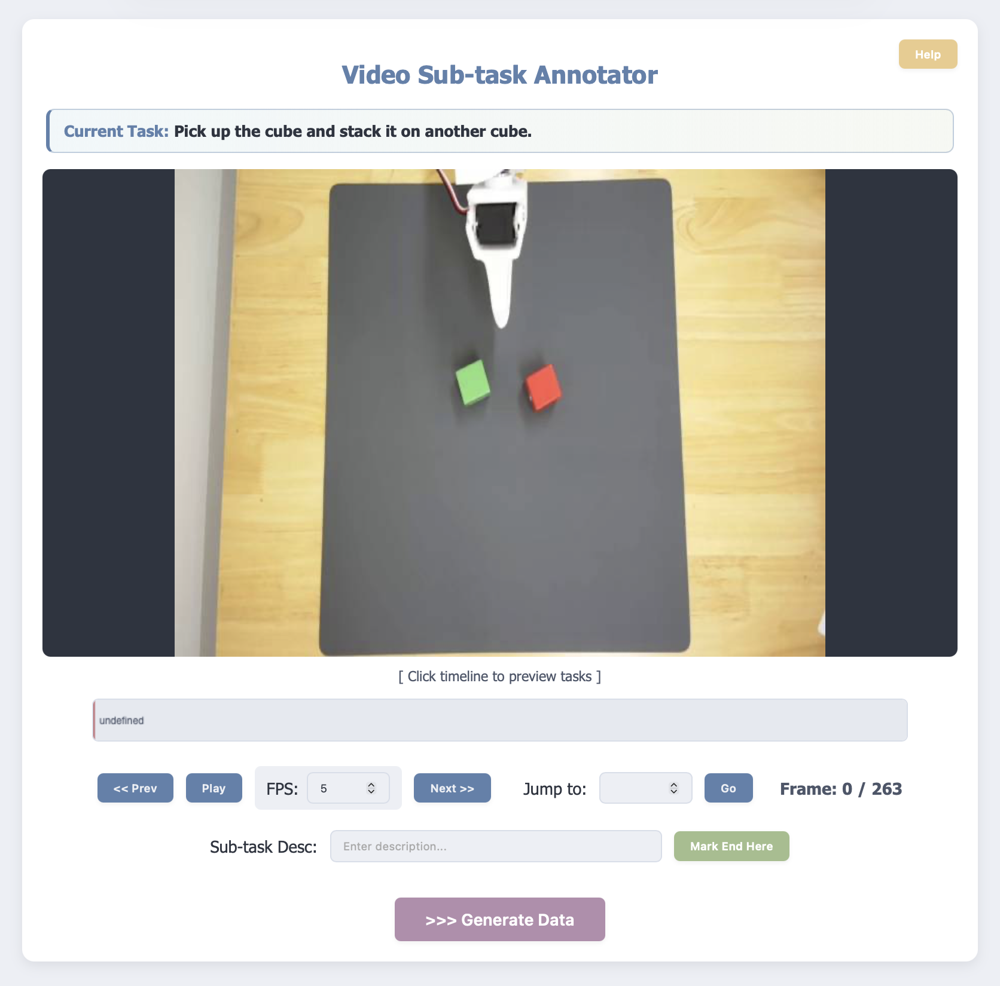

## One-Shot LoRA Adaptation

This guide explains how to adapt ProcVLM to a new environment with one successful task demonstration, or with a small set of successful and unsuccessful demonstrations (not necessarily, one successful demonstration already archives high accuracy). The workflow is:

1. Collect demonstration videos.
2. Annotate coarse sub-task stages with the web UI.
3. Register the generated dataset in `evqa/data/__init__.py`.
4. Run one-shot LoRA training.
5. Use the saved LoRA checkpoint for progress inference.

### 0. Prepare Demonstration Trajectories

For one-shot adaptation, prepare at least one successful trajectory for the target task. You can also include additional successful or unsuccessful demonstrations if they cover useful variations of the same task and environment.

The videos only need coarse sub-task annotations. ProcVLM does not require dense per-frame action labels for this workflow.

### 1. Annotate Sub-Tasks

We provide a visual annotation UI at `evqa/one-shot/annotator.py` to help you annotate the trajectories within minutes.

Start the annotator from the project root:

```bash
python evqa/one-shot/annotator.py \
    --video_path path/to/your/video.mp4 \
    --task "Task description for the video (e.g., 'Make a sandwich')" \
    --data_output_dir path/to/lora_dataset/
```

By default, the server runs on port `5110`. Open the printed URL in your browser, usually:

```text
http://localhost:5110
```

The UI looks like this:



In the UI, move through the timeline, split the trajectory into several contiguous sub-task stages, and finally mark whether the overall task was completed.

You can click `>>> Generate Data` as soon as the task is completed or the progress reaches the cutoff. The remaining unannotated frames will be marked as either `Done` or `Not Done` based on your judgment, and they will not be used to compute intermediate progress.

#### Sub-Task Annotation Guidelines

Each sub-task should describe a clear action and a direct task-relevant goal. The segmentation does not need to be overly fine-grained as long as each stage is actionable and unambiguous.

For example, if the task is `put the bread into the drawer`, both of the following decompositions are acceptable:

```text
open the drawer -> put the bread into the drawer -> close the drawer
```

```text
open the drawer -> grasp the bread -> put the bread into the drawer
```

Avoid using the original task alone, such as `put the bread into the drawer`, as a sub-task description, because the active object and immediate action may be ambiguous. Also avoid splitting the action into unnecessarily tiny steps, as the annotations should describe maximal contiguous action phases rather than low-level motion fragments.

When marking the final task status, it is recommended to add a short reason explaining why the task is completed or not completed. This text is used to calibrate the model's reasoning during fine-tuning.

If a segment should be excluded from the dataset, enter `/delete` as its sub-task description.

### 2. Register the Generated Dataset

After annotation, the annotator automatically creates a dataset under `path/to/lora_dataset/`. The important output file is:

```text
path/to/lora_dataset/qa_pairs.jsonl
```

Add the dataset to the `data_dict` dictionary in `evqa/data/__init__.py`. For example:

```python
data_dict = {
    # ...
    "train_oneshot": {
        "annotation_path": "path/to/lora_dataset/qa_pairs.jsonl",
        "data_path": "path/to/lora_dataset/",
    },
}
```

If you annotate multiple videos into the same `data_output_dir`, the annotator appends new samples to the same `qa_pairs.jsonl`, so the same dataset entry can cover all of those demonstrations.

### 3. Run LoRA Training

Edit `evqa/one-shot/lora_oneshot.sh` and set the dataset name to the key you added in `evqa/data/__init__.py`:

```bash
DATASETS="train_oneshot%100"
```

Also check `MODEL_PATH`, `OUTPUT_DIR`, `LOG_DIR`, and `CUDA_VISIBLE_DEVICES` in the script.

Then launch training:

```bash
bash evqa/one-shot/lora_oneshot.sh
```

The script saves the LoRA checkpoint under `OUTPUT_DIR`.

### 4. Run Inference with the LoRA Checkpoint

To use the saved LoRA model for progress reward inference, pass the LoRA checkpoint path as `--model_path` and add `--use_lora`:

```bash
python evqa/inference.py \
    --model_path path/to/checkpoints/oneshot_lora_xxx \
    --video_path path/to/your/test_video.mp4 \
    --output_path path/to/progress_predictions.jsonl \
    --task "Task description for the video" \
    --window_size 8 \
    --use_lora
```

The output JSONL file contains one sampled `frame_index` and its corresponding `progress` prediction per row.
